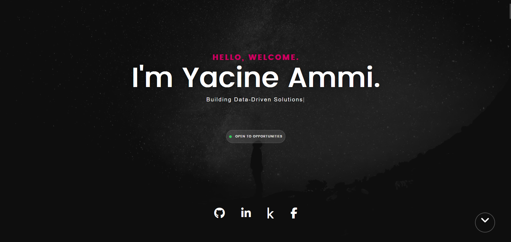

# Yacine Ammi - Personal Portfolio

This repository contains the full source code for my personal portfolio website, designed to showcase my journey, skills, and projects in Data Science, Data Analysis, and Data Engineering.

---

### 🚀 Live Demo

**The live version of this portfolio is available at: [https://yacineammi.me](https://yacineammi.me)**

---



### 📝 Project Overview

This website serves as a central hub for my professional work. Originally based on the "Kards" template by Styleshout, the site has been significantly customized and modernized with new sections, a timeline-based experience, an icon-driven skills grid, and updated project showcases to reflect my current professional profile and capabilities.

The goal was to create a clean, modern, and fully responsive platform to present my projects in a clear and engaging manner.

### 🛠️ Tech Stack & Tools

This website was built using a combination of foundational web technologies and modern deployment practices:

*   **Core:** HTML5, CSS3, JavaScript
*   **Libraries:** jQuery, Font Awesome, Devicon
*   **Deployment:** Git, GitHub, and [Netlify](https://www.netlify.com/) for continuous deployment.
*   **Development:** Visual Studio Code with the "Live Server" extension for local development.

### ✨ Key Features

This portfolio includes several custom-built and modernized features:

*   **Interactive "Open to Opportunities" CTA:** A clear, primary call-to-action in the hero section.
*   **Timeline-based Experience & Education:** A modern, scannable timeline format for presenting professional and academic history.
*   **Icon-based Skills Grid:** A visually appealing grid showcasing technical competencies with technology logos.
*   **Filterable Project Portfolio:** An interactive portfolio with modal popups providing detailed project information and links.
*   **Fully Responsive Design:** The layout is optimized to look great on all devices, from mobile phones to desktops.

### 🏃‍♀️ How to Run This Project Locally

If you'd like to explore the code or run this site locally:

1.  **Clone the repository:**
    ```bash
    git clone https://github.com/yacine-ammi/portfolio.git
    ```
2.  **Navigate to the project directory:**
    ```bash
    cd portfolio
    ```
3.  **View the site:**
    Since this is a static website, you can simply open the `index.html` file in your browser. For the best experience and to ensure all paths work correctly, I recommend using the **Live Server** extension in Visual Studio Code.

### 🙏 Acknowledgments & Credits

*   This project was built upon the foundation of the **Kards** template, generously provided by [**Styleshout**](http://www.styleshout.com/).
*   Icons provided by [Font Awesome](https://fontawesome.com/) and [Devicon](https://devicon.dev/).
*   JavaScript libraries used include [jQuery](https://jquery.com/) and [Magnific Popup](https://dimsemenov.com/plugins/magnific-popup/).

### 📄 License

The custom code, modifications, and content in this portfolio are licensed under the MIT License.